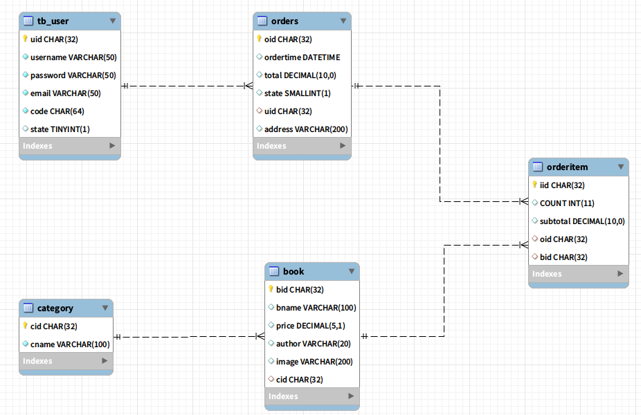

# 项目：网上书城
## 一、搭建环境
### 导入原型
1. 用户模块

2. 分类模块

3. 图书模块

4. 购物车模块

5. 订单模块

### 功能分析
1. 前台
    1. 用户模块：
        1. 注册
        2. 激活
        3. 登录
        4. 退出
    
    2. 分类模块：
        1. 查看所有分类
    
    3. 图书模块：
        1. 查看所有图书
        2. 按分类查询图书
        3. 查询图书详细信息(按id查询)
    
    4. 购物车模块：
        1. 添加购物车条目
        2. 清空所有条目
        3. 删除指定条目
        4. 我的购物车(按用户查询购物车)
        
    5. 订单模块：
        1. 生成订单
        2. 我的订单(按用户查询订单)
        3. 按id查询订单
        4. 确认收货
        5. 付款功能(只是跳转到银行页面)
        6. 付款回调功能(由银行来调用我们这个方法，表示用户已经付款成功)
        
2. 后台：
    1. 管理员模块：
        1. 登录
        
    2. 分类管理：
        1. 添加分类
        2. 查看所有分类
        3. 删除分类
        4. 按id查询
        5. 修改分类
        
    3. 图书管理模块：
        1. 查看所有图书
        2. 按id查询图书
        3. 删除图书
        4. 修改图书
        5. 添加图书(上传图片)
        
    4. 订单管理模块：
        1. 查询所有订单
        2. 按状态查询订单
        3. 发货
        
        
# 框架搭建
## 导入包   
1. 数据库：
    1. mysql驱动
    2. c3p0(jar包和配置文件)
    3. dbutils
    4. itcast-tools
        1. commons-beanutils
        2. common
        
2. javamail
    1. mail.jar
    2. activation.jar

3. 上传
    1. commons-fileupload
    2. commons-io

4. ajax
    1. json-lib
    2. 

## 创建package
1. 根：cn.devinkin.bookstore
    1. user模块：
        1. domain
        2. dao
        3. service
        4. web.servlet
    2. category：
        1. domain
        2. dao
        3. service
        4. web.servlet
    
    3. book
        1. domain
        2. dao
        3. service
        4. web.servlet
        
    4. car
        1. domain
        2. web.servlet
    
    5. order
        1. domain
        2. dao
        3. service
        4. web.servlet
        
## 创建数据库表
### 表结构
1. tb_user
2. category
3. book
4. orders
5. orderitem

### 表关系



# 用户模块实现
## 用户模块的相关类创建
1. domain：User
2. dao： UserDao
3. service：UserService
4. web.servlet：UserServlet

## 功能实现
### 用户注册
1. 流程：/jsps/user/regist.jsp -> UserServlet#regist()

2. 涉及的页面
    1. regist.jsp
        1. 表单页面，请求UserServlet#regist()方法
        2. 参数：整个表单数据
    2. msg.jsp

3. Servlet：
    1. UserServlet#regist(User form)
        1. 一键封装表单数据到User form对象中
        2. 补全：uid、激活码
        3. 进行输入校验(不访问数据库)：
            1. 保存错误信息到request
            2. 保存当前表单数据(form)到request域(回显)
            2. 转发回到regist.jsp
        4. 调用service#regist()方法，传递form过去
            1. 如果抛出异常：保存错误信息、保存表单数据(回显)、转发到regist.jsp
            2. 如果没有抛出异常：
                1. 发邮件(发件人、收件人、标题、内容)，内容中包含超链接，超链接指向可完成激活的一个Servlet地址！链接中要有激活码参数
                2. 保存成功信息到request中
                3. 转发到msg.jsp

4. Service：
    1. UserService#regist()
        1. 校验用户是否被注册，如果注册了，抛出UserException
        2. 校验邮箱是否被注册，如果注册了，抛出UserException
        3. 把user插入到数据库中
    
5. Dao：
    1. UserDao
        1. UserDao#User findByUserName(String username)：按用户名查询用户
        2. UserDao#User findByEmail(String email)：按email查询用户
        3. UserDao#void add(User form)：插入用户到数据库中

### 用户激活
1. 流程：用户的邮件中->UserServlet#active()->msg.jsp

2. UserServlet#active()
    1. 获取参数：激活码
    2. 使用激活码来调用service#active(String code)方法
        1. 保存异常信息到request中
        2. 转发到msg.jsp
    3. 保存激活信息到request中
    4. 转发到msg.jsp
    
3. UserService#active(String code)
    1. 使用code去查数据库，得到User对象
        1. 如果数据库返回的是null，抛出异常
    2. 查看用户的状态
        1. true：抛出异常
        2. false：修改用户的状态为true
       
4. UserDao#active(String code)
    1. findByCOde(String code)
    2. void updateState(String uid, state);
    
### 用户登录
1. 流程：/jsps/user/login.jsp -> UserServlet#login() -> index.jsp

2. UserServlet#login()
    1. 一键封装(只有用户名和密码)
    2. 输入校验(略)
    3. 调用service方法完成登录
        1. 保存异常信息、保存form，转发回login.jsp
    4. 保存用户信息到session中
    5. 重定向到index.jsp
    
3. UserService#User login(User form)
    1. 使用username查询数据库，得到user对象
        1. 如果user为null，抛出异常(用户名不存在)
    2. 比较form与user的密码是否相同
        1. 如果不同，抛出异常(密码错误)
    3. 查看用户状态
        1. 如果未激活，抛出异常(你还没有激活)
    4. 返回User

4. UserDao
    1. User findByUsername(String username)
    
    
### 用户退出
1. 流程： top.jsp->UserServlet#quit->login.jsp

2. UserServlet#quit()
    1. 把session销毁
    

   
# 分类模块的实现
## 分类模块的相关类创建
1. cn.devinkin.bookstore.category
    1. domain：Category
    2. dao：CategoryDao
    3. service：CategoryService
    4. web.servlet：CategoryServlet
    
    
## 查询所有分类功能实现
1. 流程：main.jsp(`<iframe>`) -> CategoryServlet#findAll() -> left.jsp


# 图书模块
## 创建相关类
1. cn.devinkin.bookstore.book
   1. domain：Book
   2. dao：BookDao
   3. service：BookService
   4. web.servlet：BookServlet
   
## 查询所有图书实现
1. 流程 left.jsp(全部分类)->BookServlet#findAll()->/jsps/book/list.jsp

2. BookServlet#findAll()
    1. 调用BookService得到结果，保存到request中
    2. 转发到/jsps/book/list.jsp

3. BookService#findAll()
    1. 调用BookDao#findAll()
    
## 按分类查询图书实现
1. 流程:left.jsp->BookServlet#findByCategory()->list.jsp

2. BookServlet#findByCategory()
    1. 获取cid参数
    2. 调用service得到结果，保存到request中
    3. 转发到/jsps/book/list.jsp

## 查询图书详细信息实现
1. 流程：list.jsp->BookServlet#load(String bid)->desc.jsp

2. BookServlet#load(String bid)
    1. 获取bid
    2. 使用service得到Book对象，保存到request
    3. 转发到/jsps/book/desc.jsp
    

# 购物车模块
1. 购物车结构
    1. 保存在session中
    2. 保存在cookie中
    3. 保存在数据库中
    
## 创建相关类
1. 购物车的结构
    1. CartItem类：包含图书和数量
    2. Cart类：包含一个Map<String,CartItem>表示所有的条目

## 添加购物车条目
1. 流程/jsps/book/desc.jsp->CartServlet#add()->/jsps/cart/list.jsp
 
2. /jsps/book/desc.jsp
    1. 传递bid、count到CartServlet

3. CartServlet#add()
    1. 从session中得到车(登陆时已经添加了车)
    2. 获取表单参数：bid、表单参数：数量
    3. 通过bid得到book对象(使用BookService)
    4. 使用Book和数量来创建CartItem
    5. 把CartItem添加到车中
    6. 返回到/jsps/cart/list.jsp

4. /jsps/cart/list.jsp
    1. 从session中得到车
    2. 再遍历车中所有CartItem

## 清空购物车条目
1. 流程/jsps/cart/list.jsp->CartServlet#clear()->/jsps/cart/list.jsp

2. CartServlet#clear()
    1. 从session中得到车
    2. 调用车的clear()方法
    3. 返回到/jsps/cart/list.jsp

## 删除指定购物车条目
1. 流程/jsps/cart/list.jsp->CartServlet#delete(String bid)
    1. 得到bid
    2. 得到车
    3. 调用车的delete(bid)方法
    4. 返回/jsps/cart/list.jsp

## 我的购物车
1. 在top.jsp中存在一个链接：我的购物车，我的购物车直接访问/jsps/cart/list.jsp，它会显示session中车的所有条目


# 订单模块
## 创建相关类
    1. domain
        Order
        OrderItem
    
    2. dao:
        OrderDao
        
    3. service
        1. OrderService
       
    4. web.service
        1. OrderService
        

## 生成订单
1. 流程/jsps/cart/list.jsp->OrderServlet#add()->/jsps/order/desc.jsp

2. OrderServlet#add()
    1. 创建Order对象
        1. 其中订单是通过购物车生成的！
        2. 从session中获取cart
        3. 然后使用cart来生成order
        4. 清空购物车
        
    2. 用来调用service的add(Order order)方法
    
    3. 保存生成的订单，转发到/jsps/order/desc.jsp
    
3. OrderService#add(Order)
    1. 操作应该是一个事务
        1. 保存订单
        2. 保存该订单的所有条目

4. OrderDao
    1. `addOrder(Order order)`
    2. `addOrderItemList(List<OrderItem> orderItem)`
        1. 使用批处理完成
        
5. /jsps/order/desc.jsp
    1. 显示当前订单
    2. request域中得到order
    
## 我的订单(按用户查)
1. 流程 top.jsp->OrderServlet#myOrders()->

2. OrderServlet#myOrders()
    1. 从session中获取User，再获取uid
    2. 使用uid来调用service方法得到List<Order>，保存到request中
    3. 转发/jsps/order/list.jsp

3. OrderDao#findByUid(String uid)
    1. 使用uid为条件查询所有的订单
    2. 循环遍历每个订单，然后再为每个订单加载它自己的所有条目
    3. 返回List<Order>
    
4. /jsps/order/list.jsp
    1. 循环遍历多个订单
    2. 两层循环
    
## 加载订单(按id查)
1. 流程 /jsps/order/list.jsp->OrderServlet#load()->/jsps/order/desc.jsp

2. OrderServlet#load()
    1. 获取oid
    2. 通过oid来调用service得到Order
    3. 保存到request域，转发到desc.jsp显示

## 确认收货
1. /jsps/order/desc.jsp->OrderServlet#confirm(oid)->msg.jsp

2. OrderServlet#confirm()
    1. 获取oid参数
    2. 使用oid调用service
        1. 有异常
            1. 保存异常信息，转发到msg.jsp
        2. 没异常
            2. 保存成功信息，转发到msg.jsp
            
3. OrderService#confirm(String oid)
    1. oid查询订单状态
    2. 判断状态是否等于3，如果不是抛出异常
    3. 调用dao修改订单状态方法，完成修改操作

4. OrderDao
    1. getStateByOid(String oid)
    2. updateState(String oid, int state)
    
## 支付(去银行)
### 支付形式
1. 在线支付的两种形式
    1. 电商与银行直连！
        1. 安全
        2. 不收手续费
        3. 不与小电商合作
    
2. 第三方支付平台
    1. 支付宝
    2. 易宝
    3. 财富通
    
3. 好处：
    1. 不安全
    2. 收手续费
    3. 小电商可以与其合作
    
### 需要在第三方注册一个账号
1. 需要认证！
2. 我们有一个易宝的测试账号
    1. 钱就转过去就要不回来了！

### 易宝支付
1. 去银行
    1. 易宝给我们一个地址(支付网关)，重定向到这个地址即可。
    2. 还需要给这个地址后添加13+1个参数！
    
2. 请求地址：
```html
https://www.yeepay.com/app-merchant-proxy/node?p0_Cmd=Buy&
p1_MerId=10001126856&
p2_Order=E1DC1A768683491D8F57FD552F804808&
p3_Amt=0.01&
p4_Cur=CNY&
p5_Pid=&
p6_Pcat=&
p7_Pdesc=&
p8_Url=http://localhost:8080/bookstore/OrderServlet?method=back&
p9_SAF=&
pa_MP=&
pd_FrpId=BOCO-NET-B2C&
pr_NeedResponse=1&
hmac=
```
```html
https://www.yeepay.com/app-merchant-proxy/node?p0_Cmd=Buy&p1_MerId=10001126856&p2_Order=123456&p3_Amt=1&p4_Cur=CNY&p5_Pid=&p6_Pcat=&p7_Pdesc=&p8_Url=http://localhost:8080/bookstore/OrderServlet?method=back&p9_SAF=&pa_MP=&pd_FrpId=CCB-NET-B2C&pr_NeedResponse=1&hmac=9fc0bca72f423233bb345302663b1d40
```

3. 易宝回调：
    1. 点对点：易宝直接访问电商，这里没有客户端什么事了。
        1. 这种方式是必须要使用的，我们这种方式是收不到的！因为我们没有固定ip
        2. 易宝有一个重发机制，如果它访问你，如果不给易宝响应，易宝会一直重发!
        3. 电商需要返回一个SUCCESS开头的字符串即可！
    2. 引导客户端浏览器重定向到电商，是让客户端访问电商！
        1. 可以不使用。

4. hmac：13参数值+keyValue(密钥) + 算法(md5)
    1. keyValue=69c1522AV6q613Ii4W6u8K6XuW8vM1N6bFgyy769220IuYe9u37N4y7rI4Pl
    2. 底层为md5的算法：PaymentUtil.buildHmac(14个),它返回hmac

### 实现
1. 重定向！
    1. 13+1个参数
    
2. 流程 /jsps/order/desc.jsp->OrderServlet#pay()->

3. OrderServlet#pay()
    1. 准备13+1个参数
        1. oid
        2. 收货地址(修改订单的收货地址)
        3. 支付通道
        4. 有的来自配置文件：易宝账号、keyValue
        5. 有的来自我们自定义
        6. 有的来自表单
        7. 来自计算
        
    2. 重定向到易宝的支付网关

4. OrderServlet#back()
    1. 获取11+1参数
    2. 校验访问者的身份是否为易宝
        1. 使用11个参数，与keyValue生成hmac
        2. 使用自己生成的hmac与hmac参数进行比较
        3. 查看订单的状态是否为1
            1. 如果为1，修改订单状态为2，加积分
    3. 判断回调方式
        1. 重定向
        2. 如果是点对点
            1. 回馈SUCCESS
        3. 保存成功信息，转发到msg.jsp

## 支付(银行回馈)

# 后台
1. 后台的内容，必须要设置权限！
2. 用户可以访问一个网站的哪些内容？
    1. dao：不行
    2. service：不行
    3. servlet：能
    4. jsp：能
    
3. 用户可以访问的只有WEB层

## 管理员模块：
1. 登录
        
## 分类管理：
1. 相关类创建
    1. domain：Category
    2. dao：CategoryDao
    3. service：CategoryService
    4. admin.web.servlet：AdminCategoryServle(为管理员提供单独的Servlet，给这个Servlet添加过滤器！)
### 查看所有分类
1. 流程 /adminjsps/admin/left.jsp->AdminCategoryServlet#findAll()->/adminjsps/admin/category/list.jsp
2. AdminCategory#findAll()
    1. 调用service得到所有的分类List<Category>
    2. 保存到request域
    3. 转发到/adminjsps/admin/category/list.jsp
3. list.jsp
    1. 修改list.jsp：修改页面，显示所有分类
    
### 添加分类
1. /adminjsps/admin/category/add.jsp->AdminCategoryServlet#add()->AdminCategoryServlet#findAll()
2. AdminCategoryServlet#add()
    1. 封装表单数据
    2. 补全：cid
    3. 调用service方法完成添加工作
    4. 调用findAll方法()
### 删除分类
1. /adminjsps/admin/list.jsp(删除链接)->AdminCategoryServlet#delete()->AdminCategoryServlet#findAll()
2. AdminCategoryServlet#delete()
    1. 获取参数：cid
    2. 调用service方法完成删除！
        1. 如果出现异常，保存异常信息转发到msg.jsp显示
    3. 调用findAll()
3. AdminCategoryService#delete(cid)
    1. 通过cid查看该分类下的图书本数
        1. 如果大于0，抛出异常
        2. 如果等于0，删除该分类
    
### 修改分类
1. 修改分为两步
    1. 加载分类
    2. 修改分类
2. 流程/adminjsps/admin/list.jsp->AdminCategoryServlet#editPre()->/adminjsps/admin/category/mod.jsp->AdminCategoryServlet#edit()
3. AdminCategoryServlet#editPre()
    1. 获取cid
    2. 通过cid来调用service方法，得到Category对象
    3. 保存到request域中，转发到mod.jsp
4. mod.jsp
    1. 把当前的Category对象显示到表单中
    2. 修改分类
        1. mod.jsp(提交表单)
        2. AdminCategoryServlet#edit()
5. AdminCategoryServlet#edit()
    1. 封装表单数据
    2. 调用service方法完成修改工作
    3. 调用findAll()
### 按id查询
        
## 图书管理模块：
1. 相关类创建
    1. book.web.servlet.admin
        1. AdminBookServlet
        2. AdminAddBookServlet(添加图书，包含上传)
            1. 上传不能使用BaseServlet，因为BaseServlet中需要使用getParameter()方法，而上传getParameter()不能使用
### 查看所有图书
1. 流程 /adminjsps/admin/left.jsp(菜单项(查看图书))->AdminBookServlet#findAll()->/adminjsps/admin/book/list.jsp
2. AdminBookServlet#findAll()
    1. 查询所有图书，保存到request
    2. 转发到/adminjsps/admin/book/list.jsp
3. /adminjsps/admin/book/list.jsp：循环遍历所有图书
### 加载图书
1. 流程 /adminjsps/admin/book/list.jsp->AdminBookServlet#load()->/adminjsps/admin/book/desc.jsp
2. AdminBookServlet#load()
    1. 获取bid参数
    2. 使用service通过bid调用bookService方法得到Book对象
    3. 使用categoryService#findAll()，保存`List<Category>`，保存到request域中
    4. 保存到request中，转发到desc.jsp
3. desc.jsp
    1. 使用book.category.cid 与category.cid比较，让每次进入desc.jsp选中正确的分类
### 添加图书(上传图片)
1. 添加图书分两步：

2. 第一步：
    1. 加载所有分类，到/adminjsps/admin/book/add.jsp中显示！
        1.流程 /adminjsps/admin/book/left.jsp(菜单项：添加图书)->AdminBookServlet#addPre()->/adminjsps/admin/book/list.jsp
        
    2. AdminBookServlet#addPre()
        1. 查询所有分类，保存到request域中，转发到/adminjsps/admin/book/add.jsp中

    3. 在/adminjsps/admin/book/add.jsp中循环遍历所有分类，显示在`<select>`中
    
3. 第二步(添加图书)：
    1. 流程 /adminjsps/admin/book/add.jsp(提交按钮)->AdminAddBookServlet#addBook()->/adminjsps/admin/book/list.jsp
    2. 上传三步
         1. 创建工厂
         2. 创建解析器
         3. 解析request得到表单字段！
    3. 把表单字段封装到Book对象中
    4. 保存上传文件，把保存的路径设置给Book的image属性
    5. 调用service方法保存Book对象到数据库中
    6. 调用findAll
### 删除图书
1. book表与orderitem表有关联关系

2. 删除图书不是真的在数据库表中删除记录，而是给book表添加一个del字段，它是boolean类型，表明是否被删除。

3. 没有被删除的图书，该列的值为false，删除了的书，为true

4. 处理问题
    1. 修改BookDao：所有查询相关的方法，都需要添加where条件，即del=false
    2. 添加Book类del属性

5. 删除图书：
    1.其实就是把表的del列修改为true！

6. 流程 /adminjsps/admin/book/list.jsp->AdminBookServlet#delete()->AdminBookServlet#findAll()

7. AdminBookServlet#delete()
    1. 获取参数bid
    2. 调用service的delete犯法
    3. 返回到/adminjsps/admin/book/list.jsp页面
    

### 修改图书
1. 流程 /adminjsps/admin/desc.jsp->AdminBookService#edit()->AdminBookService#findAll()

2. AdminBookServlet#edit()
    1. 封装表单数据(必须让页面保证把image传递过来)
        1. 要求页面必须添加一个隐藏字段，把原来的图片路径传递过来
    2. 调用service方法完成删除
    3. return findAll()
        
### 订单管理模块：
### 查询所有订单
1. 流程 /adminjsps/admin/left.jsp->AdminOrderServlet#findAll()->/adminjsps/admin/order/list.jsp
2. AdminOrderServlet#findAll()
    1. 调用service查找所有订单
        1. 使用categoryDao#loadOrderItems(order)获取`List<OrderItem>`，并保存到Order中
        2. 使用categoryDao#loadUser(order)获取User对象
    2. 将`List<Order>`保存到request域中
    3. 转发到/adminjsps/admin/order/list.jsp页面
3. 订单状态
```html
1->未付款
2->等待发货
3->确认收货
4->交易成功
```

### 按状态查询订单
1. 流程 /adminjsps/admin/left.jsp->AdminOrderServlet#findOrderByState(int state)->/adminjsps/admin/order/list.jsp
2. AdminOrderServlet#findOrderByState(int state)
    1. 获取请求参数state
    2. 调用servicefindOrderByState(state)方法，将`List<Order>`对象保存到request域中
    3. 转发到/adminjsps/admin/order/list.jsp
### 发货
1. 流程 /adminjsps/admin/order/list.jsp->AdminOrderServlet#delivery()->AdminOrderServlet#findAll()
2. AdminOrderServlet#delivery()
    1. 调用OrderService#updateState(oid)方法，调用findAll()方法
   